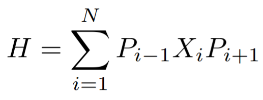
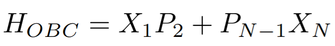
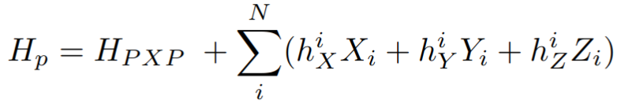

# ScarsProject

This repository is dedicated to the exploration and analysis of the PXP model, utilizing the power of the QuTiP library for quantum simulations. The PXP model, known for its relevance in quantum many-body physics, is studied here through various computational techniques to understand its dynamics and eigenstate properties.

## Overview

The PXP model simulations are performed using the QuTiP library, a comprehensive toolkit for quantum information processing and quantum optics simulations. This repository contains code for simulating time evolution, analyzing eigenstates, and evaluating overlaps between states in the context of the PXP model.

### Getting Started

### Dependencies

To run the simulations, you will need to have the following libraries installed:

- Python 3.x
- QuTiP: Quantum Toolbox in Python, used for quantum system simulations.
- NumPy: Fundamental package for scientific computing with Python.
- Matplotlib: A Python 2D plotting library which produces publication quality figures.
- SymPy: A Python library for symbolic mathematics.

### Repository Contents

Below is a description of the primary scripts and modules in this repository:

- **TimeEvol_PXP.py**: Simulates the time evolution of the PXP model, with options for introducing perturbations. It supports both Periodic and Open Boundary Conditions.

  **Hamiltonian Definitions Visualized**:

    
   
    
   
  

- **pxp_eigenstates.py**: Computes the eigenstates of the PXP Hamiltonian, offering insights into the system's quantum states.

- **overlapEigen.py**: Calculates the overlap between the system's initial state and its eigenstates, providing a measure of state fidelity.

- **statesqu.py**: A utility module for constructing initial quantum states relevant to the PXP model.

- **operators.py**: Defines operators used in constructing the Hamiltonian and other quantum mechanical properties of the chain.

### Results

The repository also includes results showcasing the PXP model's dynamics and the scripts' capabilities. These results offer a glimpse into the quantum behaviors captured by the simulations.

## References

The QuTiP library is a cornerstone of this project, enabling sophisticated quantum simulations:

1. Johansson, J. R., Nation, P. D., & Nori, F. (2013). QuTiP 2: A Python framework for the dynamics of open quantum systems. *Comp. Phys. Comm.*, 184, 1234. [DOI: 10.1016/j.cpc.2012.11.019](https://doi.org/10.1016/j.cpc.2012.11.019).

2. Johansson, J. R., Nation, P. D., & Nori, F. (2012). QuTiP: An open-source Python framework for the dynamics of open quantum systems. *Comp. Phys. Comm.*, 183, 1760–1772. [DOI: 10.1016/j.cpc.2012.02.021](https://doi.org/10.1016/j.cpc.2012.02.021).

---

We hope this repository aids in your exploration of quantum dynamics through the PXP model. For any inquiries or contributions, feel free to open an issue or a pull request.

